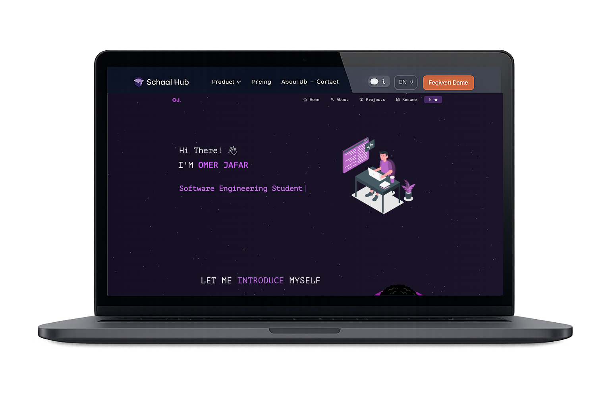

<div align="center">
  <h1>OJ's Portfolio</h1>
  <p>Personal portfolio website built with React</p>
  <p>
    <a href="https://portfolio-amoori.vercel.app/">View Live</a>
  </p>
</div>



## Tech Stack

- **Framework**: React 17
- **UI**: React Bootstrap, Bootstrap 5
- **Routing**: React Router DOM
- **Animations**: react-tsparticles, react-parallax-tilt, typewriter-effect
- **Icons**: react-icons
- **Other**: axios, react-github-calendar, react-pdf, @react-pdf/renderer, video-react

## Features

- Particle animation background
- Interactive project cards with GitHub links
- GitHub contribution calendar
- Resume viewer with PDF download
- Typing animation on homepage
- Responsive design
- Dark theme

## Getting Started

```bash
git clone https://github.com/amoori01/Portfolio.git
cd Portfolio
npm install
npm start
```

Open [http://localhost:3000](http://localhost:3000) to view it in the browser.

## Build

```bash
npm run build
```

## Deployment

Deployed on [Vercel](https://vercel.com).
